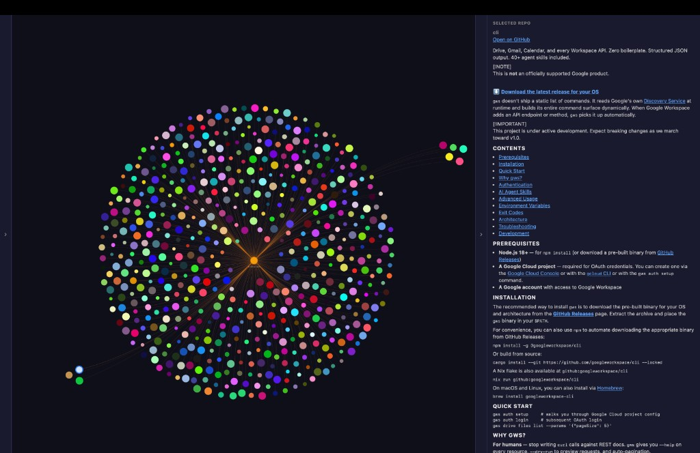

# Spellbook + GitHub stars — unified viewer

<<<<<<< HEAD
Fork of https://github.com/raufer/graphify repo built out with Claude Code, Grok and Cursor to accomodate my specific (growing) tech stack.


Static HTML tools that combine a **Spellbook knowledge graph** and a **GitHub stars “nebula”** in one tab, with **clean README** rendering in the parent page.
=======
**Source repo:** [github.com/nickarchuleta/graphify-viewer](https://github.com/nickarchuleta/graphify-viewer)
>>>>>>> e832845 (Docs: thesis, screenshots, privacy sweep; redact graph data; neutral stars header)

This is a **local-first** HTML bundle: there is no hosted app URL. You clone or download the repo and open the files from disk (or a tiny static server).

## Why this exists

Flat lists of repos don’t match how a lot of us think. This viewer is for **fast capability assessment**: see your **Spellbook** (ideas, docs, wiring) and your **GitHub stars** as **living graphs**, drag nodes around, cluster by community, and read READMEs in context—closer to **flipping through samples in Ableton** than scrolling a spreadsheet. Same energy as *“what if I put this hip-hop loop with that dubstep bass?”*—**serendipity**: *what if I combine this with that?* Built for brains that like **non-linear, visual remixing** over linear bookmarks.

<p align="center">
  
  <br />
  <sub>Stars “nebula”: one hub, hundreds of repos, colored by hash—scan your whole star field at once.</sub>
</p>

<p align="center">
  
  <br />
  <sub>Unified viewer: Spellbook ↔ Stars on the left, cleaned README on the right (serve over http for GitHub API).</sub>
</p>

## Run it (your machine)

**Option A — same as you’ve been using:** open the file directly (some features may still work):

`file:///…/graphify-out/graph_unified.html`  
(on your Mac, that is often under `~/graphify-out/graph_unified.html`.)

**Option B — recommended:** local server so README fetch from GitHub works reliably:

```bash
git clone https://github.com/nickarchuleta/graphify-viewer.git
cd graphify-viewer
python3 -m http.server 8765
```

Then open **http://localhost:8765/graph_unified.html**

- **Left strip:** **Spellbook map** ↔ **Stars nebula** (collapsible).
- **Right strip:** hints + **Selected repo** README in stars mode (collapsible, scrollable).
- **Keys:** `1` / `2` switch views; `[` / `]` collapse/expand the right panel.

## Files

| File | Purpose |
|------|---------|
| `graph_unified.html` | Main shell: iframes + docks + README pipeline |
| `readme_render.js` | Strip badge HTML, render Markdown (`ReadmeSkin`) |
| `graph.html` | Spellbook graph (your graphify export) |
| `github_stars_mirror.html` | Stars hub-and-spoke graph (regenerate from JSON) |
| `graph_hub.html` | Redirects to `graph_unified.html` |

Architecture / recovery notes: **[README-unified.md](./README-unified.md)** · **Privacy / what’s safe to publish:** **[docs/PRIVACY.md](./docs/PRIVACY.md)**

## Regenerate stars mirror

Put `master_stars_all.json` under `data/` (see `data/README.md`), then:

```bash
python3 scripts/render_github_stars_mirror.py
```

## Publishing updates

```bash
git add -A && git commit -m "Your message" && git push
```

## License

MIT — see [LICENSE](./LICENSE).
